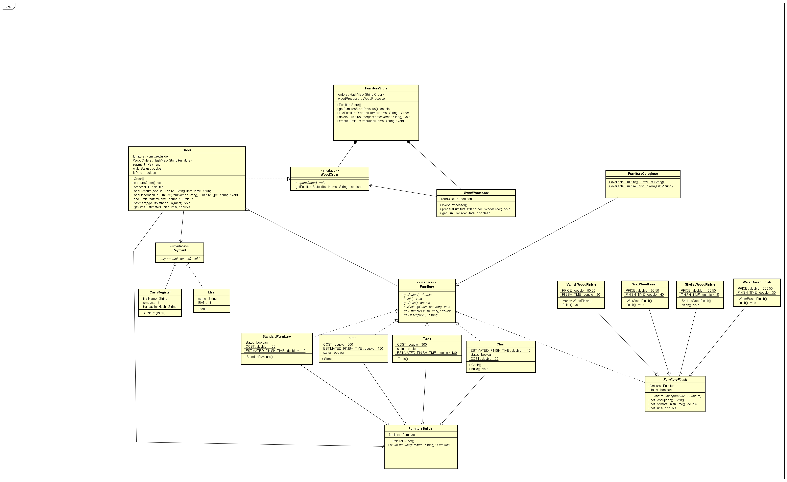

# Design Patterns Furniture System

## UML

By: Virag, Jonathan and Isaac.

##### About the Furniture System 

The purpose of the furniture system is to create a system where customer can build and buy custom and standard furniture.

The Furniture store is made up of 19 classes. The purpose of this system is to serve as an application that will be used by the furniture store employees. Below are the following features of the system: 

- Creating furniture such as chairs, tables, and stool. 
- Keep track of customer furniture orders. 
- Prepare the furniture orders. 
- Decorating furniture with accessories of the user's choice. 
- Provide payment option per furniture order. 
  

##### Which patterns are used: 

- Strategy pattern for the payment of furniture. 
- Factory pattern for building the Furnitures. 
- Decorator pattern for adding accessories to the furniture. 
- Observer pattern for setting the furniture process status after finishing room is done preparing furniture orders. 
  

##### Implementation 

To build this project, we would use IntelliJ IDE as our code editor, GitHub for version control and collaborative work, and it would be severed as a console application.